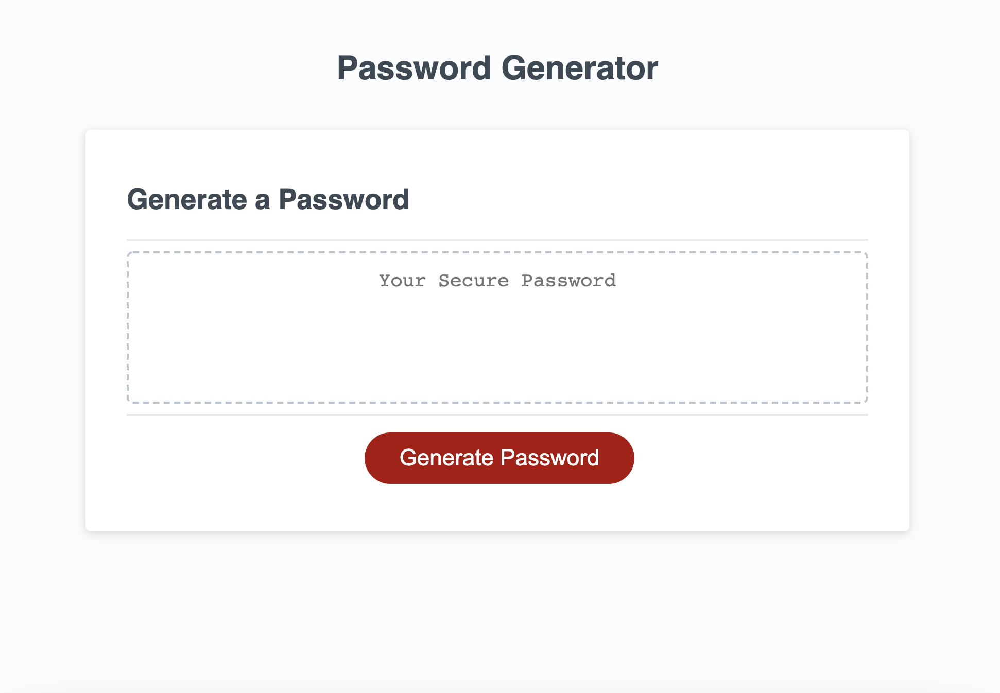

# Password Generator

This assignment, through modifying and expanding upon starter code, focuses on using JavaScript to create an application allowing users to randomly generate a secure password based on criteria they select. Based on the assignment's acceptance criteria, I plan to use prompts (or confirmations) to determine the user's criteria, and update the HTML using JavaScript to display the generated password. If possible, I may also add an element of HTML content that displays (for confirmation) which criteria the user selected, for their own reference. 

Through doing this, I learned a lot about how to use objects and iterate over them, how to convert arrays into strings, and quite a few other things about how JavaScript works in general. Notably, it was interesting to see how, when my goal was to make an array of arrays, the array ended up being an array of strings, which included the commas from the previous arrays. I didn't notice this at first, but then I saw that the addition of those commas was making passwords with way too many commas in them (since every other character in each string was a comma, commas were much more likely to be randomly selected as the next character). To avoid this, I changed the list of characters from arrays to strings.

This was a really fun assignment that I was actually able to finish in one (rather long) sitting.

## Screenshot of completed application:

## Link to deployed application:
[Tucker Barrett's Password Generator](http://grinninbarrett.github.io/password-generator "Tucker's deployed password generator application")